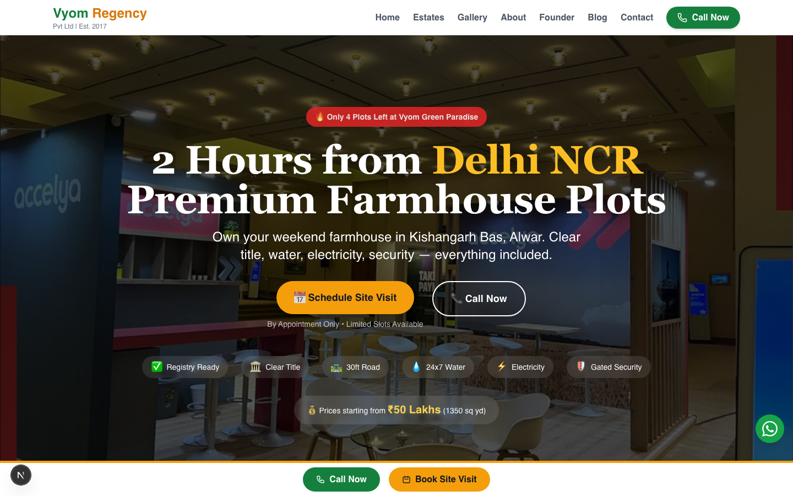
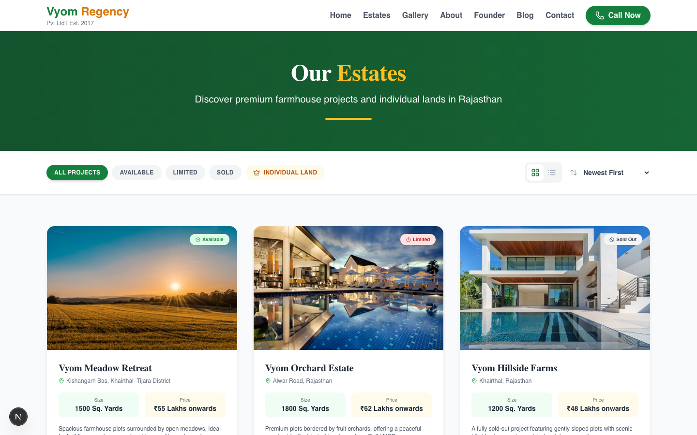
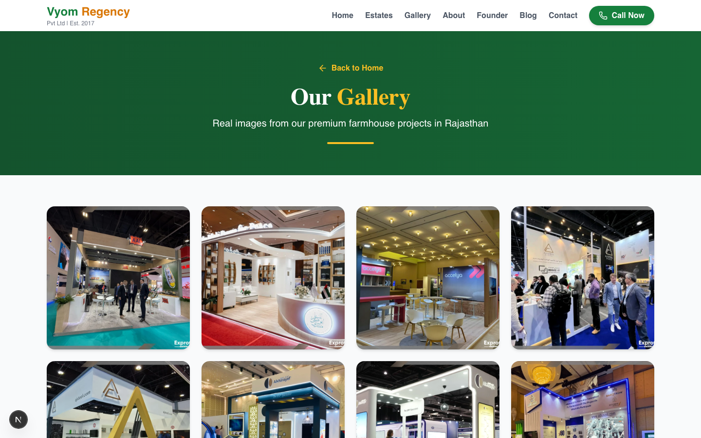
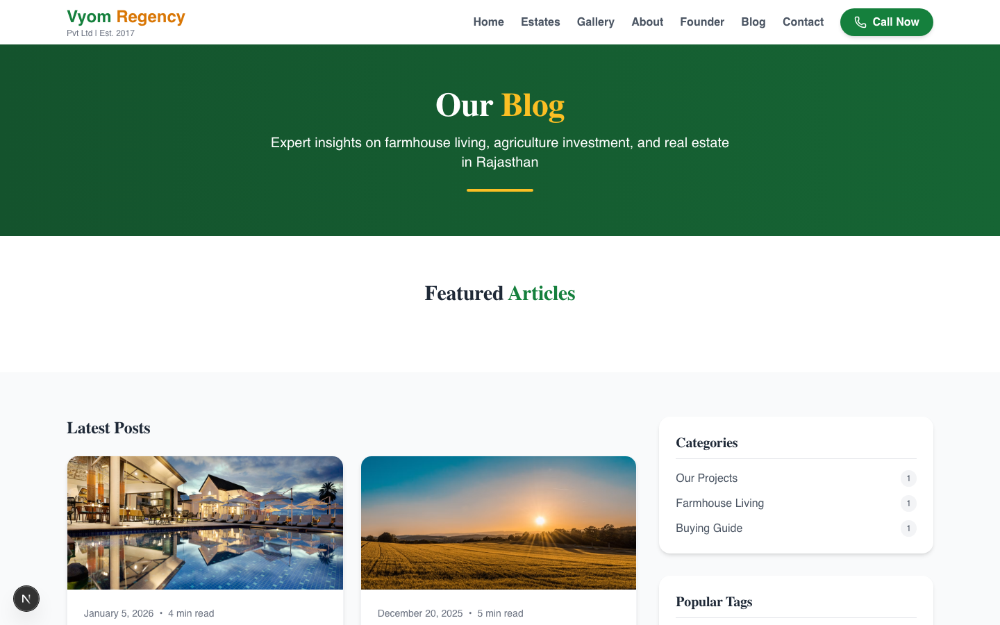
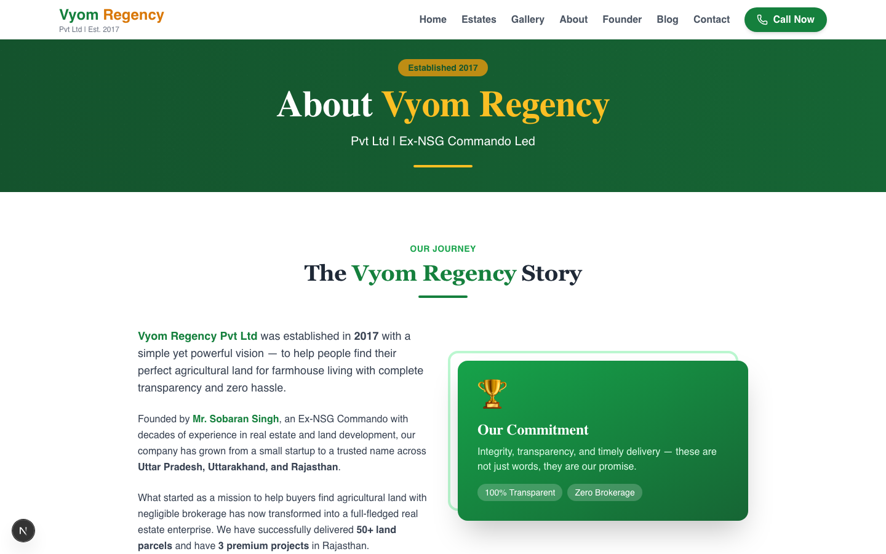
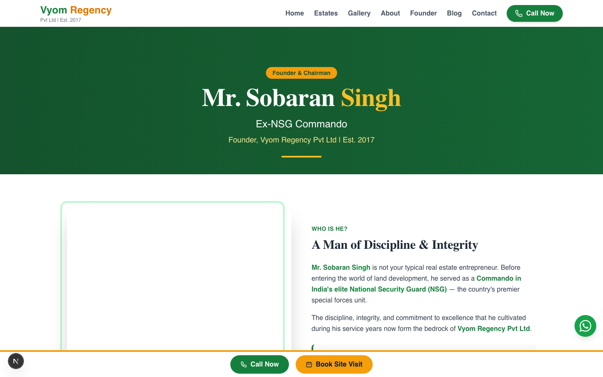
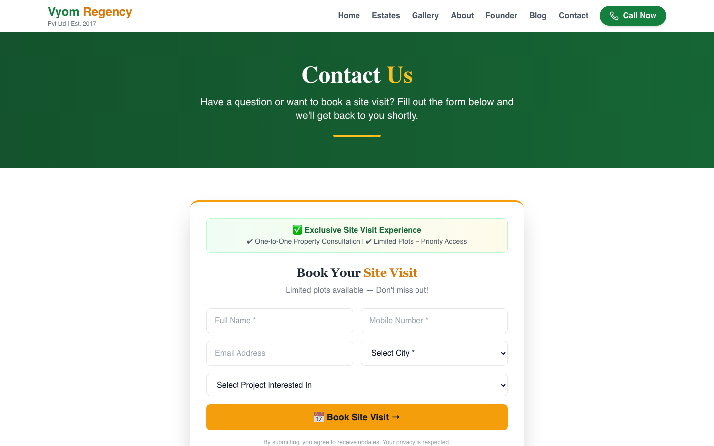

# Vyom Regency Pvt Ltd — Website & Admin Panel

A Next.js real estate marketing site for **Vyom Regency**, a premium farmhouse plot developer in Kishangarh Bas, Alwar, Rajasthan (2 hours from Delhi NCR). Includes a full public marketing site plus a custom admin panel (CMS) backed by Supabase for managing properties, blog posts, testimonials, gallery photos, and leads — no code changes required for day-to-day content updates.

## What the site looks like

**Look & feel:** Editorial/premium real-estate aesthetic — dark forest-green hero banners with amber/gold accents, serif display headings (Playfair Display) paired with clean sans-serif body text (Inter), rounded pill-shaped buttons, and warm photography of farmhouse life and open land.

**Color palette:**

| Role | Color | Hex |
|---|---|---|
| Primary (brand green) | `green-700` / `green-premium-700` | `#193729` |
| Deep hero background | `green-900` → `green-800` gradient | `#08120e` → `#11251b` |
| Accent (CTAs, highlights) | `amber-500` | `#f59e0b` |
| Body text | `gray-800` / `gray-600` | — |
| Section backgrounds | `white` / `gray-50` | — |

**Fonts:** Playfair Display (headings, serif) + Inter (body, sans-serif).

**Public pages:**

| Route | Purpose |
|---|---|
| `/` | Homepage — hero, benefits, active projects, gallery preview, testimonials, lead form, FAQ |
| `/estates` | Full property listing with filters (available/limited/sold, individual land) |
| `/gallery` | Full photo gallery with lightbox |
| `/about` | Company story and values |
| `/founder` | Founder bio and career timeline |
| `/blog` | Blog listing, categories, and tags |
| `/blog/[slug]` | Individual blog post |
| `/contact` | Contact form (site visit booking) |
| `/location` | Location and connectivity info |
| `/admin/login` | Admin panel sign-in |

**Admin panel** (`/admin/*`, requires login): Dashboard, Leads, Properties, Testimonials, Blog, Media (image uploads), Hero Banner. Changes made here reflect live on the public site immediately — no redeploy needed.

### Screenshots

| Home | Estates |
|---|---|
|  |  |

| Gallery | Blog |
|---|---|
|  |  |

| About | Founder |
|---|---|
|  |  |

| Contact |
|---|
|  |

## Tech stack

- **Framework:** Next.js 15 (App Router) + React 19 + TypeScript
- **Styling:** Tailwind CSS + shadcn/ui components
- **Backend:** Supabase (Postgres database, Auth, Storage)
- **Package manager:** pnpm
- **Hosting:** Vercel

## Getting started (local development)

**Prerequisites:** Node.js 20+, [pnpm](https://pnpm.io/installation) (`npm install -g pnpm` if you don't have it).

1. **Install dependencies:**
   ```bash
   pnpm install
   ```

2. **Set up environment variables** — copy `.env.example` to `.env.local` and fill in your Supabase project's credentials (Project Settings → API in the Supabase dashboard):
   ```bash
   cp .env.example .env.local
   ```
   ```
   NEXT_PUBLIC_SUPABASE_URL=https://your-project.supabase.co
   NEXT_PUBLIC_SUPABASE_PUBLISHABLE_KEY=sb_publishable_...
   SUPABASE_SERVICE_ROLE_KEY=sb_secret_...
   NEXT_PUBLIC_BASE_URL=http://localhost:3000
   ```
   If you're setting up a **brand new** Supabase project (not reusing an existing one), run the SQL scripts in [`supabase/new-project-setup.sql`](supabase/new-project-setup.sql) and [`supabase/storage-list-policy.sql`](supabase/storage-list-policy.sql) in the Supabase SQL Editor first — these create all required tables, security policies, and storage buckets.

3. **Run the dev server:**
   ```bash
   pnpm dev
   ```
   Open [http://localhost:3000](http://localhost:3000).

4. **Log into the admin panel** at `/admin/login` — create an admin user first via Supabase dashboard → Authentication → Users → Add user.

## Deploying to Vercel

1. Push this repo to GitHub (already set up if you're reading this from the deployed repo).
2. In Vercel: **Add New → Project** → import the repo.
3. Framework preset: **Next.js** (auto-detected).
4. **Install command:** `pnpm install --frozen-lockfile`
5. **Build command:** `pnpm build`
6. **Output directory:** leave as default.
7. Add these environment variables (same as `.env.local`, using your production Supabase project):
   - `NEXT_PUBLIC_SUPABASE_URL`
   - `NEXT_PUBLIC_SUPABASE_PUBLISHABLE_KEY`
   - `SUPABASE_SERVICE_ROLE_KEY` (mark as **Sensitive**)
   - `NEXT_PUBLIC_BASE_URL` (your final `*.vercel.app` or custom domain)
8. Click **Deploy**.

## Useful scripts

```bash
pnpm dev      # start local dev server
pnpm build    # production build
pnpm start    # run a production build locally
pnpm lint     # run ESLint
```

## Project structure

```
src/
  app/            # Next.js App Router pages (public + /admin + /api)
  components/      # Shared React components (Header, Footer, Hero, etc.)
  components/ui/   # shadcn/ui primitives
  lib/             # Supabase clients, helpers (blog data layer, image upload)
  integrations/    # Supabase browser client
supabase/          # SQL setup scripts and migration history
```

See [CHANGELOG.md](CHANGELOG.md) for a history of notable fixes and features.
